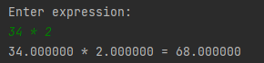

# Simple-Calculator

This is my first program built with C, it is a simple mathematics calculator that performs simple
arithmetic operations such as addition, subtraction, multiplication, division, and allows for exponents using the caret symbol.

